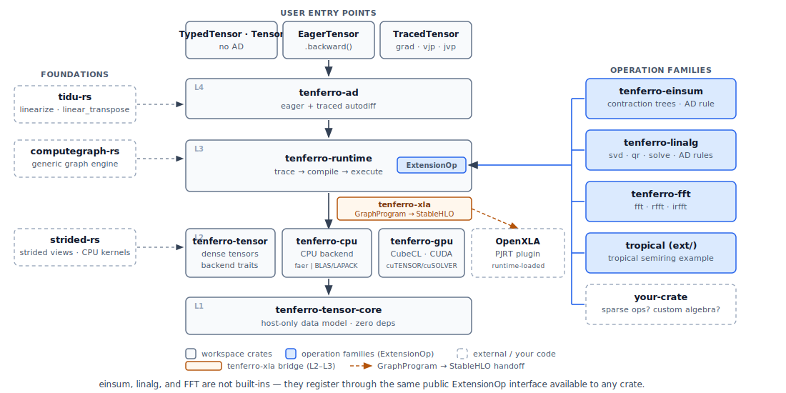

# 从 Julia 到 Rust：AI 智能体时代面向科学计算的可微张量栈

*[tenferro-rs](https://github.com/tensor4all/tenferro-rs) 是一个 Rust 原生的稠密张量栈：线性代数、PyTorch 风格的 eager 自动微分、JAX 风格的 traced 变换、NumPy 风格的 einsum、FFT、可扩展的运算 crate，以及显式的 CPU/CUDA 后端。首批 crate 已于 2026 年 6 月 23 日（JST）发布到 crates.io。*

作者: **Hiroshi Shinaoka**（埼玉大学），tensor4all 团队

*🌐 [English](https://tensor4all.org/blog/introducing-tenferro-rs/) · [日本語](https://tensor4all.org/blog/introducing-tenferro-rs-ja/) · [简体中文](https://tensor4all.org/blog/introducing-tenferro-rs-zh/)*



---

张量网络代码过去常用 Julia 写，我们也一样。ITensors 及其周边生态很适合做原型：代码可以贴近数学表达，试错也快。我们自己的 IR 基、稀疏建模，以及 [tensor4all](https://tensor4all.org) 的张量交叉插值（TCI）／quantics 栈，最早也是在 Julia 中开发的。

不过，代码库变大以后，Julia 开发会逐渐变重。类型不稳定往往到运行时才出现，编译和预编译会拉长编辑与测试的往返时间，代码越多，也越难确认它是否真的正确。把张量网络栈嵌入更大的系统时，这些问题已经不能再忽略。于是我们开始把计算引擎移到 Rust。

开始之后不久，我们又发现了另一个问题：想作为基础使用的张量库还没有准备好。Rust 有按用途分开的库。数组有 ndarray，深度学习有 Burn，线性代数有 faer。但我们需要的是一层能把自动微分和 einsum 连起来、又适合科学计算的张量层。我们并不是要取代这些库，而是要连接已经存在的部分。

Rust 生态这几年变化很大。crates.io 从 2015 年的 602 个 crate 增长到 2026 年的约 21 万个（[数据](https://github.com/shinaoka/rust_crate_count)）。稠密线性代数有 faer，GPU kernel 有 [CubeCL](https://github.com/tracel-ai/cubecl)，通用数值有 `num-traits` 和 `num-complex`。邻近层也已经有不少库：数组有 ndarray，线性代数有 nalgebra 和 faer，深度学习框架有 Burn 和 candle，NumPy 风格的数组 API 有 numr。我们需要的是它们之间的科学计算张量栈：列主序，支持动态 shape，同时有 eager 和 traced 两种自动微分，带 einsum、FFT、CPU/CUDA 后端和可扩展运算。tenferro-rs 就是为这层而做的。我们在 faer 和 CubeCL 之上补上缺的部分，而不是重新发明已有的东西。把 SparseIR.jl 和 Julia 的张量网络代码移过来以后，也更容易看清缺的是哪一层。

[tenferro-rs](https://github.com/tensor4all/tenferro-rs) 的开发就是这样开始的。这篇文章解释了我们为什么要做这个栈。如今代码已经不再只由人来写，这篇文章也会说明，在这样的背景下我们为什么选择了 Rust。

## 为什么现在选 Rust，而不是 Julia

两三年前，我大概会建议学生先从 Julia 开始。Julia 可以写得接近数学，内存管理也轻松，数值计算库也齐全。当时 Rust 要学的东西更多，库也还不够。

现在我不会再这样建议。不是因为 Rust 本身突然变了，而是因为代码已经不再只由人来写。

Fortran、Python、Julia 的发展方向，都包含一个共同目标：降低人类手写、阅读和维护代码的成本。可读性、REPL、接近数学的记法、低门槛，都是为了这个目标。AI 开始写更多代码以后，取舍变了。写得快没有以前那么重要。学习成本也有相当一部分可以交给智能体承担。可是，“读起来像数学”并不保证正确。别名（aliasing）、可变性（mutation）、内存分配（allocation），从一行代码的表面看不出来。

对我们来说，问题从“人能多快写出来”变成了“我们能多有把握地确认它是正确的”。从这个标准看，Rust 的理由就清楚了。

具体来说，下面几点很重要。

- 所有权和类型能在编译时排除很大一类错误。`cargo check` 几秒就能返回结果，所以智能体写错时，我们不用等到运行时才发现。
- 构建、依赖解析、测试、基准测试都在 Cargo 里完成。不需要 CMake，也没有链接阶段的版本冲突。整套栈和依赖从零构建，在笔记本上大约两分钟；编辑和测试的循环只要几十秒。
- Rust 按模块和 crate 边界控制符号可见性。智能体只能在某一层的**内部**工作，不能伸手改另一个 crate 的内部，也不能悄悄破坏抽象。对一个由 AI 写成、约 13 万行的代码库来说，这个边界很重要。
- 生命周期和所有权的机械性复杂度可以大体交给智能体处理，人的注意力就能放在算法、设计和正确性上。过去 Rust 入门阶段的不利因素，现在没有以前那么重。

在 C++、Python、Julia 里写大型代码库时，经常会担心“这个规模还能不能验证”。用 Rust 时，这种不安明显少一些。

## 从移植到栈

一开始，我们并不是要做通用张量库。我们只是想把需要的部分移过来，少花时间和工具周旋。但实现过程中逐渐发现，自动微分、后端、添加新运算的方式，都不应该关在张量网络专用的一层里。于是我们把共通部分设计成独立的张量栈。

- 运算族放在各自的 crate 中，而不是塞进一个单体张量类型。
- 自动微分规则放在张量类型之外。按照 Julia/ChainRules 的经验，导数规则属于运算本身，而不是属于某个具体的张量类。AD 基础设施 [tidu-rs](https://github.com/tensor4all/tidu-rs) 是通用的，张量类型只是它的一个使用者。
- 后端和设备都显式处理。数据不会在 CPU 和 GPU 之间自动搬运。某个后端能不能执行一个运算，和运行时有哪些设备可用，是分开处理的问题。
- 存储采用列主序（column-major），与 Fortran、Julia、MATLAB、LAPACK/BLAS 对齐。行主序数据也可以通过带步长（strided）的视图处理，避免不必要的 eager 拷贝。

这样的设计让它也能用于张量网络以外的场景。

## 两分钟看懂 tenferro-rs

这套栈提供：带类型的张量、带 `backward()` 的即时（eager）执行、带 `grad`/`vjp`/`jvp`/HVP 的 traced 图、线性代数、einsum、FFT，以及显式的 CPU 与 CUDA（以及实验性的 WebGPU）后端。

下面是 PyTorch 风格的 eager 自动微分，计算 `sum(x²)`（其梯度为 `2x`），原样摘自仓库中的 [`eager_autodiff_pytorch_style.rs`](https://github.com/tensor4all/tenferro-rs/blob/main/docs/tutorial-code/src/bin/eager_autodiff_pytorch_style.rs)：

```rust
use tenferro_ad::{EagerRuntime, Tensor};

fn assert_close(actual: &[f64], expected: &[f64]) {
    assert_eq!(actual.len(), expected.len());
    for (index, (actual, expected)) in actual.iter().zip(expected).enumerate() {
        let error = (actual - expected).abs();
        assert!(
            error < 1.0e-12,
            "value {index}: actual={actual}, expected={expected}, error={error}"
        );
    }
}

fn main() -> Result<(), Box<dyn std::error::Error>> {
    let runtime = EagerRuntime::new();
    let x = runtime.variable_from(Tensor::from_vec_col_major(
        vec![3],
        vec![1.0_f64, 2.0, 3.0],
    )?)?;

    let prediction = x.mul(&x).unwrap();
    let loss = prediction.reduce_sum(&[0])?;

    assert_eq!(loss.shape(), &[]);
    assert_close(loss.materialized()?.as_slice::<f64>().unwrap(), &[14.0]);

    loss.backward()?;

    let grad = x
        .grad()?
        .expect("tracked variable should receive a gradient");
    assert_eq!(grad.shape(), &[3]);
    assert_close(grad.as_slice::<f64>().unwrap(), &[2.0, 4.0, 6.0]);

    x.clear_grad()?;
    assert!(x.grad()?.is_none());

    Ok(())
}
```

这个例子里，程序会自己检查结果。这个小例子也反映了我们开发库时的基本做法。同样的计算也可以作为 JAX 风格的 traced 图运行，编译一次后复用，并带有 `grad`/`vjp`/`jvp`（见 [`traced_autodiff_jax_style.rs`](https://github.com/tensor4all/tenferro-rs/blob/main/docs/tutorial-code/src/bin/traced_autodiff_jax_style.rs)）。可以按需要选择层次：带类型的张量、带自动微分的 eager 执行，或者 traced 图。自动微分、CUDA、einsum、FFT、线性代数都可以只在需要时启用。

## 尺寸会随数据变化的计算

JAX 和 XLA 很擅长优化 shape 固定的计算，并对同一 shape 的输入快速重复执行。但一旦 shape 开始依赖数据，比如截断阈值、自适应的键维（bond dimension）、依赖数据的迭代次数，事情就会变难。如果尺寸只能在运行时知道，每出现一个新 shape 就可能需要重新编译。为了避免重新编译而退回 eager 执行时，`grad` 和 `vjp` 这样的变换也很难留在同一个流程里。

这是张量网络和很多自适应科学计算的日常，我们手头处理的大部分问题都是这样。对于 rank 或 bond dimension 会随数据变化的计算，能在不重新编译的情况下复用同一个 traced 程序很有用。

tenferro 会把 traced 程序编译一次。即使具体尺寸（rank、阈值、迭代次数）到运行时才确定，也会**复用**同一个程序。这个过程中 `grad`、`vjp`、`jvp` 仍然可用。另一方面，对于尺寸静态确定的计算，我们也让它能够使用 OpenXLA。`tenferro-xla` 会把图 lowering 到 StableHLO，并可以加载 PJRT 插件，所以原则上可以达到与 JAX 相同的执行速度。

## 从外部检查正确性

AI 写出的数值计算库有一个明显的风险：代码看起来正确，实际却是错的。

所以我们不把信任只建立在“读代码”上。我们准备了不依赖人工目视检查的机制。

- 正确性用有限差分和 PyTorch 参考 oracle 来检查。[tensor-ad-oracles](https://github.com/tensor4all/tensor-ad-oracles) 是一个独立的数据库和生成器，用来检查张量与线性代数运算的导数正确性，并包含不变量、残差检查和来源（provenance）检查。
- 性能用可复现的 [tenferro-benchmark](https://github.com/tensor4all/tenferro-benchmark) 套件，与 PyTorch 和 JAX 比较。很多 target 上，tenferro 已经达到接近 PyTorch/JAX 的 CPU/GPU 性能，后续还有优化空间。这里不固定写数字，而是链接到 benchmark 仓库，因为那里是可复现的参照，数字也会更新。
- 设计也写成文档。REPOSITORY_RULES.md、AGENTS.md、设计笔记和 worklog 记录架构及其约束，供人和智能体共同参考。当一次失败暴露出缺少规则，例如“运算族应该是一等 crate，而不是 facade”或“不要写朴素 CPU loop fallback，要用 faer 或 BLAS”，它会成为新的约束，而不是一次性的修补。这样才能让 13 万行代码的设计不随会话漂移。

oracle 和 benchmark 位于不同的仓库中，写库的智能体没法擅自更改评判标准。我们也持续把规则和代码对照，尽早发现偏离。再加上按文件设置覆盖率阈值的测试，正确性、性能和设计就由几套独立机制来检查，而不是只靠 review。

## 试一试

首批 tenferro crate 已经在 **crates.io** 上。它们不是一个单一 bundle，而是按模块发布的栈，可以只引入需要的部分：

```toml
[dependencies]
tenferro-tensor = "0.2"   # tensors, views, backends
tenferro-ad     = "0.2"   # eager + traced autodiff
# plus tenferro-linalg, tenferro-einsum, tenferro-fft, tenferro-cpu,
# tenferro-gpu, tenferro-xla: add only what you need
```

tenferro-rs 仍然是 v0.2 预览版，还不是定型的 1.0。但它也不是单纯的实验。我们已经把它用作 Rust 张量网络栈 [tensor4all-rs](https://github.com/tensor4all/tensor4all-rs)（TreeTN、QTT、TCI）的引擎，并在实际科学计算任务中边用边开发。如果宿主语言是 Python，JAX 和 PyTorch 是自然选择。tenferro-rs 面向的是想从 Rust 直接使用类似功能的人。因为还处在预览阶段，现在的用户反馈仍然容易反映到设计中。

特别希望在科学计算或 HPC 中用过 ndarray、nalgebra/faer、Burn/candle、PyTorch/JAX，或者 Julia/Fortran 的人试用。

- 文档与指南: https://tensor4all.org/tenferro-rs/
- 源码: https://github.com/tensor4all/tenferro-rs
- 复现基准测试: https://github.com/tensor4all/tenferro-benchmark
- 检查正确性: https://github.com/tensor4all/tensor-ad-oracles

如果你在真实科学计算任务上试用后发现缺少功能、速度慢或结果不对，请告诉我们。这类反馈对我们帮助很大。

## 致谢

感谢 [Jin-Guo Liu](https://giggleliu.github.io/) 对 tenferro 早期设计的贡献，感谢 [Satoshi Terasaki](https://terasakisatoshi.github.io/) 的开发支持。

*披露：本文由 AI 编程智能体与作者协作撰写，定稿过程也走了本文提到的人工验证流程。*
